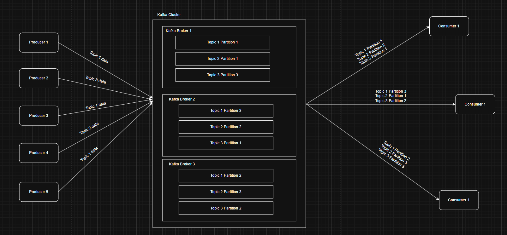
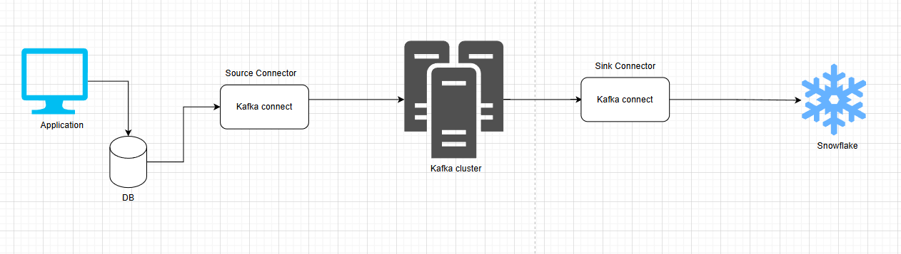
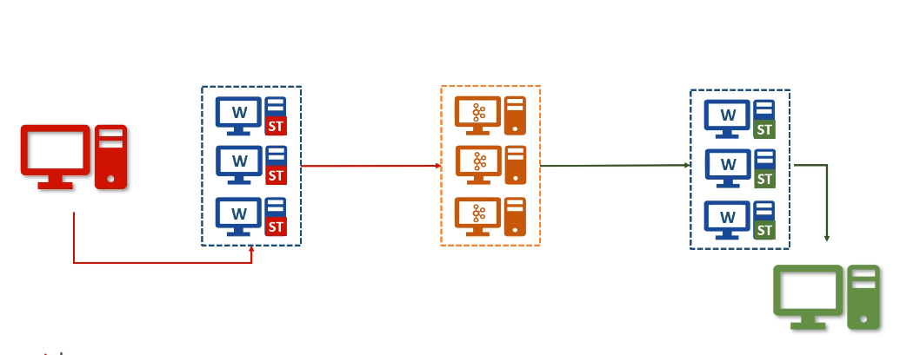
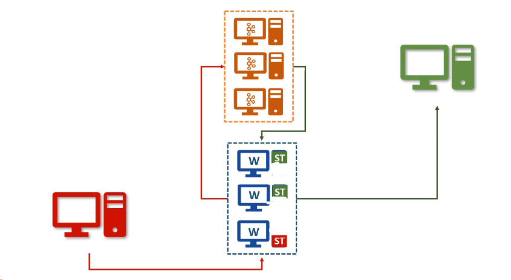
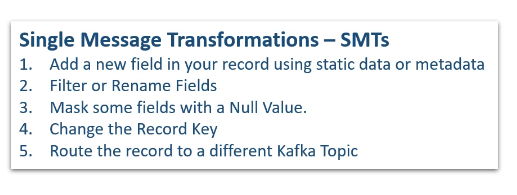
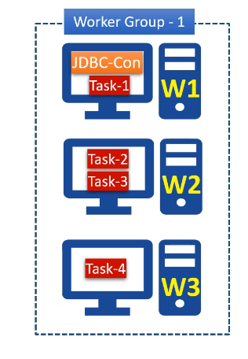
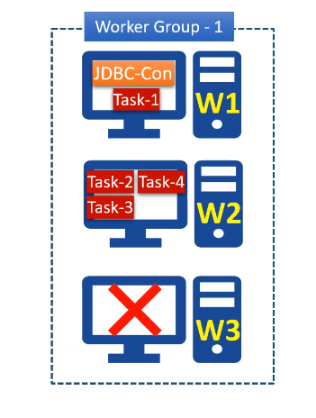
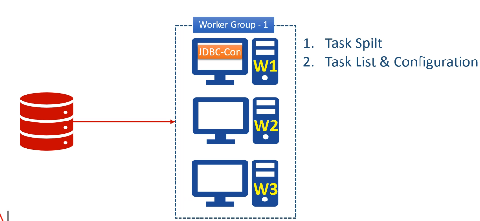
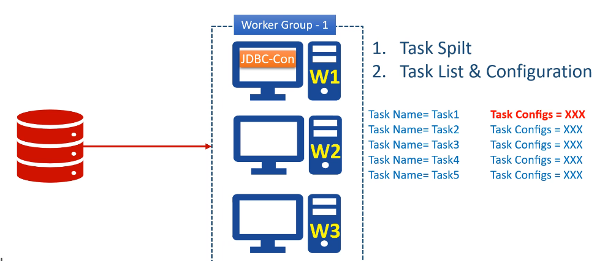
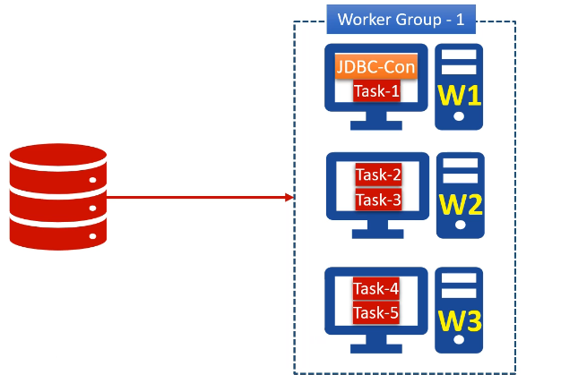

# Kafka

### Apache Kafka

1. Apache Kafka is a distrubuted streaming platform. It means Kafka can be used:-
   1. Creating real time data streams
   2. Processing real time data streams
2. Data being continously generated and transfered in some interval of time say seconds, miliseconds etc is called Real time data stream.
3. Kafka uses pub/sub messaging system architecture and it works as an Enterprise Messaging System.
4. A typical messaging system has 3 components:- `Message Producer` **---->** `Message Broker` **---->** `Message Consumer`
5. Producer is a client application that sends data records also known as messages. The broker recieves the messages produced and stores them in local storage. Consumers are client applications that consumes/read messages from the broker and processes it.

### Components of Kafka

1. Kafka Broker: Central Server System
2. Kafka Client APIs: Producer and Consumer APIs
3. Kafka Connect: It address the data intergration problem
4. Kafka Streams: Library for creating real time data stream processing application.
5. KSQL: Its for real time database.

### Important Concepts for Kafka:

1. Producer:
   1. Producer is an application that sends data. The data is refered to as message. The data can have any form.
2. Consumer:
   1. Consumer is an application that receives the data/message. Consumer consumes the data produces has sent to Kafka. Consumer can consume any data being sent to the kafka broker given they have the correct permissions. The consumer here requests data from the kafka server. Thus consumer has to continously ping the kafka server for data to be consumed.
3. Broker:
   1. Broker is the kafka server. The kafka server acts as a message broker between the Producer and Consumer as they can't connect directly.
4. Cluster:
   1. Cluster is a group of computers acting together for a common purpose. Kafka is a distributed system. Thus, Kafka cluster is a group of computers, each running one instance of the kafka broker.
5. Topic:
   1. Topic is an arbitrary name given to a data set. Its a unique name for a data stream. Creating a topic is a design time decision. When you are designing your application, you can create one or more topics. One you topic is there, the producers and consumers are going to send and receive data by the topic. Producers send particular data under a partcular topic and it can send different data to different topics. Consumers can listen to multiple topics from broker and have different processing for data from different topics.
   2. Suppose you are have a system which produces info about a user, product and company. As these data have different genres thus we need 3 different topics to address each category of data. Lets say we name the topics as user_topic, product_topic and company_topic. Now, the producer will send all the user, product and company data to Kafka broker under user_topic, product_topic and company_topic repectively. On Consumer side, we can either have some consumers that will only be listening to any one of the topics, means they will only be capturing and processing data from a specific topic only or some consumers might be listening to more than one topic. Data from different topics will have different meanings and different ways of processing it.
   3. In simple words, you can consider Kafka topics as database tables. Each topic is a different table. Producers produce new records of data and stores them under a specific topic table. Consumers consumes records from any of the topic tables.
6. Topic Partitions:
   1. The data stored under a particular topic can be very large in terms of storage. Thus, the broker might face a storage capacity challenge. Thus, to solve this, we break the topic into smaller parts and distribute is over multiple computers in the Kafka cluster.
   2. Kafka breaks the topic into multiple partitions and store those partitions on different machines. This solves the storage capacity problem.
   3. The number of partitions in a topic is a design decision. While creating a topic, we need to specify the number of partitions that we need. The kafka broker will produce the number of partitions.
   4. The partition is the smallest unit and it is going to be sitting on a single machine in the cluster. Thus, a meaningful estimation will be needed to decide the number of partitions for each topic.
   5. These are the core idea for making kafka distributed and hence scalable.
   6. **Kafka does not allow more than one consumer to read and process data from the same partition simutaneosly** as this is necessary to avoid the double reading of records. It means more than one cosumer can listen to data from same partition but not simultaneously.
7. Partition Offset:
   1. It is a unique squence id of a message in the partition. The sequence id is automatically assigned by the broker to every message record as it arrives in the partition.
   2. These ids are immutable.
   3. Note: **The offsets are local within the partition**. **There is no global ordering in the topic across partitions**.
   4. To locale a specific message, you have to know 3 things:
      1. Topic name
      2. Partition name
      3. Offset number
         Sequence: Topic name ---> Partition name ---> Offset number
8. Consumer Group:
   1. It is a group of consumers.
   2. Multiple consumers can form a group to share the workload.
   3. Each group will have a unique group id. A broker will be assigned a group id and it will automatically become a part of that group.
9. Diagram:
   

### Kafka connect

1. Suppose you have an application running on a server. The application has to perform 2 tasks:
   1. CRUD operations in DB
   2. Sending data to Kafka cluster to be consumed by other applications
2. You can send data to kafka cluster from the application using 2 ways:
   1. Modifying the application source code. Here in this method, you need to modify the source code and embedd Kafka producer using Kafka producer apis. The embedded kafka producer becomes part of your souce application and runs inside the application and sends data to kafka cluste.
   2. If you dont have the access to the source code of your application or it seems not feasible to modify the source code then, you can create an independent kafka producer for reading data from application database and sending it to the Kafka cluster.
3. For the second option, we already have a solution known as Kafka Connect.
4. Kafka connect is a system which you can place in between the data source (database) and the kafka cluster.
   
5. If you want to store the data from the Kafka cluster into another database (say Snowflake) then you can again use the Kafka connect to read data from kafka cluster and writing it to the snowflake.
6. **Kafka Connect Source Connector** is used to pull data from a source system and send ot to kafka cluster. Source connector will internally use the Kafka producer api.
7. **Kafka Connect Sink Connnector** is used consume data from Kafka topic and sink it to an external system. Sink connectors will internally use the Kafka consumer api.
8. Thus, Kafka connect is a component for connecting and moving data between Kafka and external systems.
9. Kafka connect provides and out of the box data integration capability without writing a single line of code.
10. The source and target of data for the Kafka connector can be different means source or target can be anyone of RDBMS, MongoDB, cassandra etc. Thus, we either need to develop a custom connector or use the connector already developed by other developers.
11. Kafka Connect Framework:
    1. Kafka connect framework allows you to write connectors.
    2. Connectors implementation:
       1. Source Connector
       2. Sink Connector
    3. Kafka connect framework takes care of scalability, fault tolerance, error handling.
    4. As a connector developer, we only need to implement the 2 java classes:
       1. SourceConnector / SinkConnector
       2. SourceTask / SinkTask
    5. Connect developer only have to take of defining the above classes rest will be taken care by Kafka Connect Framework.
    6. All the source and target system vendors create the connectors using the connector framework and share with the community to work on them
    7. We will just have to install the source and sink connector, based on the source and sink we are using, created by the vendors and configure them to be used by the kafka connect.
    8. Hence, different connector can be used by Kafka connect to connect to different data source/sinks.
12. Scalability of the Kafka connect:
    1. The Kafka connect is itself a cluster.
    2. Each individual unit in the Connect cluster is called a Connect Worker.
    3. In Source connect cluster, you can have a bunch of source task running on each worker to share the workload. One might be pulling data from some set of tables and others from other sets of table.
    4. Similarly, we can multiple workers in the Sink connector cluster.
       
13. We dont need to create separate cluster for each source and sink. We can have only one Kafka connect cluster and run as many as connectors wanted in it. Some of the connector may work as source connectors and some might work as sink connectors.
14. We can also have different source/sink connector having different source/sink running in the same cluster. It means some connectors may have RDBMS as source and some might have cassandra as source and similarly some can have snowflake as sink and some can have MongoDB as sink. They all might be running in the same connect cluster.
    
15. Connect Transformations
    1. Kafka connect was designed to perform a plain copy or data movement between 3rd party systems and kafka.
    2. In both the cases of source or sink, one side must be a Kafka cluster.
    3. Kafka connect also allow some fundamental Single Message Transformations (SMTs). It means you can apply some transformations/changes to each message on the fly.
    4. Some common SMTs:  
       
16. SMTs are not good to perform some real life data validations and transformations.
17. Kafka Connect Architecture:
    1. Kafka connect is a cluster with one or more workers running.
    2. Lets say you started a kafka connect cluster with 3 workers. These workers are fault tolerant and uses a group id to form a cluster.
    3. The workers are the main workhorse of the Kafka connect. It means they work like a container process, and they will be responsible for starting and running Connector and the task.  
       
    4. These workers are fault tolerant and self managed. It means, if a worker process stops or crashes, other workers will recognize that and reassign the connectors and tasks of the faulty worker to the remaining worker.  
       
    5. Now, if a new worker joins then others will notice that and assign the connectors or task to the new one.
    6. Thus, the workers will provide you:-
       1. Reliability
       2. High Availability
       3. Scalability
       4. Load Balancing.
    7. Lets assume, we wanted to copy the data from RDBMS. Then:
       1. We need to install the JDBC Source connector and install it within the cluster. We can install it in any of the workers.
       2. Then we need to configure the connector. The config includes database connection details, a list of tables to copy from, frequency to poll the source for new data etc depending upon the connector and requirement.
          1. All the config goes into a file and you will start the connector (like JDBC) using some command line tool.
          2. Kafka connect also offers REST Api so we can beging the connector using the rest apis.
       3. At this stage, one of the workers will start the connector process. Workers are like containers, they can start and run other processes.
          
       4. The connector process is mainly reponsible for 2 things:
          1. Task Split (Determining degree of parallelism).
             1. It means how many parallel tasks can be started to copy the data from the source. The degree of parallelism can be configured in connector config. Suppose we have 5 tables from which we want to fetch the data. The connector can start 5 parallel tasks and assign one table to each task for copying.
             2. Note: the connector is not going to copy the data. It is only responsible for defining and creating a task list.
          2. Task Config and list:
             1. Each task will be configured to read data from an assigned list of tables.
             2. The connector will also include some additional configurations like database connection details etc to make sure the task can operate as an independent process.
             3. Finally, the list of tasks will be given to the workers so that they can start the task.
             4. The task will be distributed accross the workers for balancing the cluster load.
                  
                **Tasks assigned:**  
                
       5. Now the task is reponsible for connecting with the source system, polling the data at a regular interval, collecting the records and handing over it to the worker.
          1. The task will hand over the data to worker only.
       6. The worker is responsible for sending the data received, from the tasks running on it, to the kafka cluster.
       7. In case of sink, the task is only responsible for inserting record into the target system.
       8. Reading and writing data to a kafka cluster is a standard activity so it is taken care of by the Kafka connect framework.
       9. There are 2 things changing for source and target systems and needed to be taken care by a connector developer:
          1. How to split the input for parallel processing, this is taken care by the Connector class (SourceConnector / SinkConnector)
          2. How to interact with the external system, this is taken care by the Task class (SourceTask / SinkTask)
       10. Most of the other stuff like interacting with kafka, error handling etc will be taken care by the Kafka connect framework.
