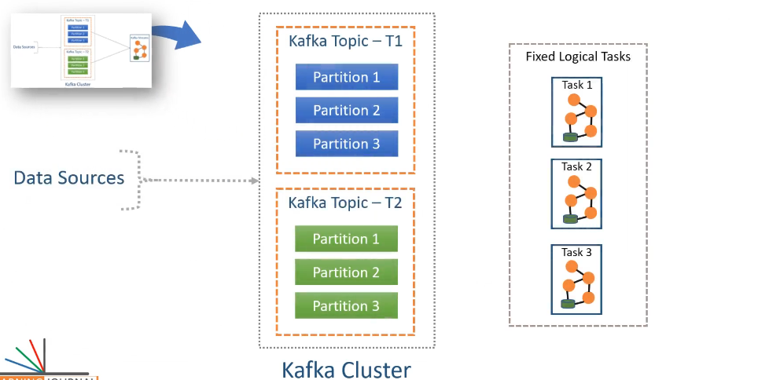
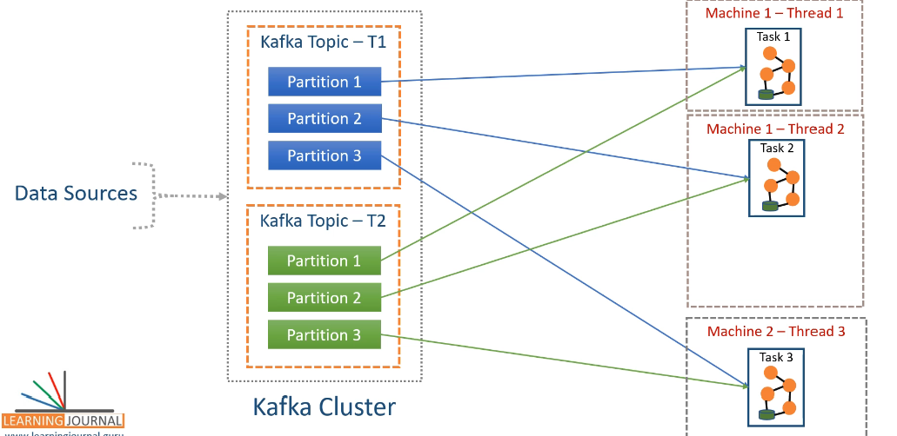
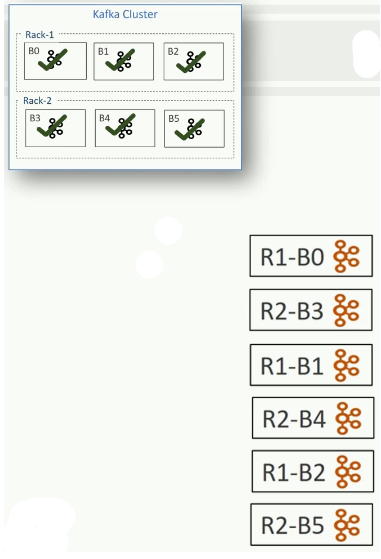
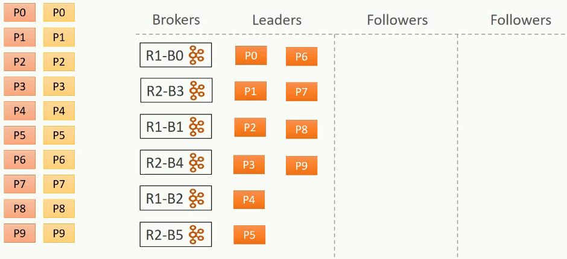
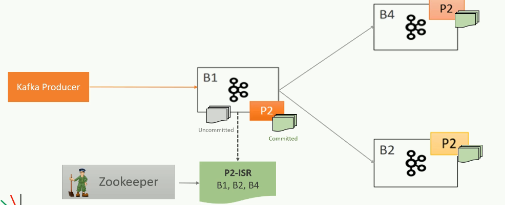
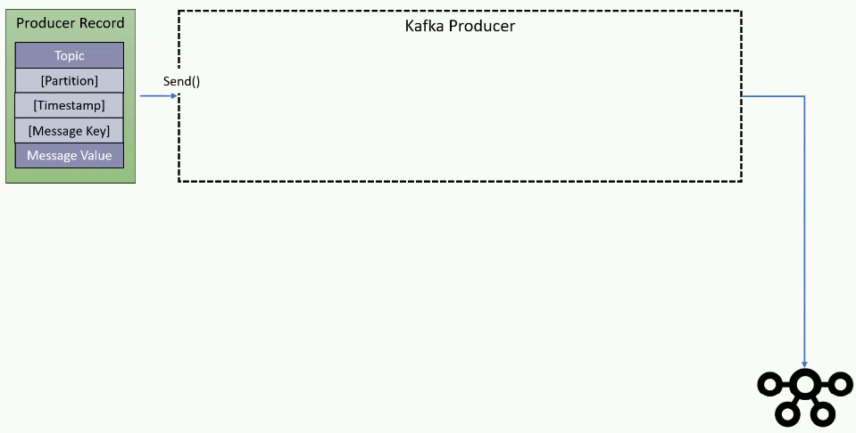

# Kafka

### Apache Kafka

1. Apache Kafka is a distrubuted streaming platform. It means Kafka can be used:-
   1. Creating real time data streams
   2. Processing real time data streams
2. Data being continously generated and transfered in some interval of time say seconds, miliseconds etc is called Real time data stream.
3. Kafka uses pub/sub messaging system architecture and it works as an Enterprise Messaging System.
4. A typical messaging system has 3 components:- `Message Producer` **---->** `Message Broker` **---->** `Message Consumer`
5. Producer is a client application that sends data records also known as messages. The broker recieves the messages produced and stores them in local storage. Consumers are client applications that consumes/read messages from the broker and processes it.

### Components of Kafka

1. Kafka Broker: Central Server System
2. Kafka Client APIs: Producer and Consumer APIs
3. Kafka Connect: It address the data intergration problem
4. Kafka Streams: Library for creating real time data stream processing application.
5. KSQL: Its for real time database.

### Important Concepts for Kafka:

1. Producer:
   1. Producer is an application that sends data. The data is refered to as message. The data can have any form.
2. Consumer:
   1. Consumer is an application that receives the data/message. Consumer consumes the data produces has sent to Kafka. Consumer can consume any data being sent to the kafka broker given they have the correct permissions. The consumer here requests data from the kafka server. Thus consumer has to continously ping the kafka server for data to be consumed.
3. Broker:
   1. Broker is the kafka server. The kafka server acts as a message broker between the Producer and Consumer as they can't connect directly.
4. Cluster:
   1. Cluster is a group of computers acting together for a common purpose. Kafka is a distributed system. Thus, Kafka cluster is a group of computers, each running one instance of the kafka broker.
5. Topic:
   1. Topic is an arbitrary name given to a data set. Its a unique name for a data stream. Creating a topic is a design time decision. When you are designing your application, you can create one or more topics. One you topic is there, the producers and consumers are going to send and receive data by the topic. Producers send particular data under a partcular topic and it can send different data to different topics. Consumers can listen to multiple topics from broker and have different processing for data from different topics.
   2. Suppose you are have a system which produces info about a user, product and company. As these data have different genres thus we need 3 different topics to address each category of data. Lets say we name the topics as user_topic, product_topic and company_topic. Now, the producer will send all the user, product and company data to Kafka broker under user_topic, product_topic and company_topic repectively. On Consumer side, we can either have some consumers that will only be listening to any one of the topics, means they will only be capturing and processing data from a specific topic only or some consumers might be listening to more than one topic. Data from different topics will have different meanings and different ways of processing it.
   3. In simple words, you can consider Kafka topics as database tables. Each topic is a different table. Producers produce new records of data and stores them under a specific topic table. Consumers consumes records from any of the topic tables.
6. Topic Partitions:
   1. The data stored under a particular topic can be very large in terms of storage. Thus, the broker might face a storage capacity challenge. Thus, to solve this, we break the topic into smaller parts and distribute is over multiple computers in the Kafka cluster.
   2. Kafka breaks the topic into multiple partitions and store those partitions on different machines. This solves the storage capacity problem.
   3. The number of partitions in a topic is a design decision. While creating a topic, we need to specify the number of partitions that we need. The kafka broker will produce the number of partitions.
   4. The partition is the smallest unit and it is going to be sitting on a single machine in the cluster. Thus, a meaningful estimation will be needed to decide the number of partitions for each topic.
   5. These are the core idea for making kafka distributed and hence scalable.
   6. **Kafka does not allow more than one consumer to read and process data from the same partition simutaneosly** as this is necessary to avoid the double reading of records. It means more than one cosumer can listen to data from same partition but not simultaneously.
7. Partition Offset:
   1. It is a unique squence id of a message in the partition. The sequence id is automatically assigned by the broker to every message record as it arrives in the partition.
   2. These ids are immutable.
   3. Note: **The offsets are local within the partition**. **There is no global ordering in the topic across partitions**.
   4. To locale a specific message, you have to know 3 things:
      1. Topic name
      2. Partition name
      3. Offset number
         Sequence: Topic name ---> Partition name ---> Offset number
8. Consumer Group:
   1. It is a group of consumers.
   2. Multiple consumers can form a group to share the workload.
   3. Each group will have a unique group id. A broker will be assigned a group id and it will automatically become a part of that group.
9. Diagram:
   

### Kafka connect

1. Suppose you have an application running on a server. The application has to perform 2 tasks:
   1. CRUD operations in DB
   2. Sending data to Kafka cluster to be consumed by other applications
2. You can send data to kafka cluster from the application using 2 ways:
   1. Modifying the application source code. Here in this method, you need to modify the source code and embedd Kafka producer using Kafka producer apis. The embedded kafka producer becomes part of your souce application and runs inside the application and sends data to kafka cluste.
   2. If you dont have the access to the source code of your application or it seems not feasible to modify the source code then, you can create an independent kafka producer for reading data from application database and sending it to the Kafka cluster.
3. For the second option, we already have a solution known as Kafka Connect.
4. Kafka connect is a system which you can place in between the data source (database) and the kafka cluster.
   
5. If you want to store the data from the Kafka cluster into another database (say Snowflake) then you can again use the Kafka connect to read data from kafka cluster and writing it to the snowflake.
6. **Kafka Connect Source Connector** is used to pull data from a source system and send ot to kafka cluster. Source connector will internally use the Kafka producer api.
7. **Kafka Connect Sink Connnector** is used consume data from Kafka topic and sink it to an external system. Sink connectors will internally use the Kafka consumer api.
8. Thus, Kafka connect is a component for connecting and moving data between Kafka and external systems.
9. Kafka connect provides and out of the box data integration capability without writing a single line of code.
10. The source and target of data for the Kafka connector can be different means source or target can be anyone of RDBMS, MongoDB, cassandra etc. Thus, we either need to develop a custom connector or use the connector already developed by other developers.
11. Kafka Connect Framework:
    1. Kafka connect framework allows you to write connectors.
    2. Connectors implementation:
       1. Source Connector
       2. Sink Connector
    3. Kafka connect framework takes care of scalability, fault tolerance, error handling.
    4. As a connector developer, we only need to implement the 2 java classes:
       1. SourceConnector / SinkConnector
       2. SourceTask / SinkTask
    5. Connect developer only have to take of defining the above classes rest will be taken care by Kafka Connect Framework.
    6. All the source and target system vendors create the connectors using the connector framework and share with the community to work on them
    7. We will just have to install the source and sink connector, based on the source and sink we are using, created by the vendors and configure them to be used by the kafka connect.
    8. Hence, different connector can be used by Kafka connect to connect to different data source/sinks.
12. Scalability of the Kafka connect:
    1. The Kafka connect is itself a cluster.
    2. Each individual unit in the Connect cluster is called a Connect Worker.
    3. In Source connect cluster, you can have a bunch of source task running on each worker to share the workload. One might be pulling data from some set of tables and others from other sets of table.
    4. Similarly, we can multiple workers in the Sink connector cluster.
       
13. We dont need to create separate cluster for each source and sink. We can have only one Kafka connect cluster and run as many as connectors wanted in it. Some of the connector may work as source connectors and some might work as sink connectors.
14. We can also have different source/sink connector having different source/sink running in the same cluster. It means some connectors may have RDBMS as source and some might have cassandra as source and similarly some can have snowflake as sink and some can have MongoDB as sink. They all might be running in the same connect cluster.
    
15. Connect Transformations
    1. Kafka connect was designed to perform a plain copy or data movement between 3rd party systems and kafka.
    2. In both the cases of source or sink, one side must be a Kafka cluster.
    3. Kafka connect also allow some fundamental Single Message Transformations (SMTs). It means you can apply some transformations/changes to each message on the fly.
    4. Some common SMTs:  
       
16. SMTs are not good to perform some real life data validations and transformations.
17. Kafka Connect Architecture:
    1. Kafka connect is a cluster with one or more workers running.
    2. Lets say you started a kafka connect cluster with 3 workers. These workers are fault tolerant and uses a group id to form a cluster.
    3. The workers are the main workhorse of the Kafka connect. It means they work like a container process, and they will be responsible for starting and running Connector and the task.  
       
    4. These workers are fault tolerant and self managed. It means, if a worker process stops or crashes, other workers will recognize that and reassign the connectors and tasks of the faulty worker to the remaining worker.  
       
    5. Now, if a new worker joins then others will notice that and assign the connectors or task to the new one.
    6. Thus, the workers will provide you:-
       1. Reliability
       2. High Availability
       3. Scalability
       4. Load Balancing.
    7. Lets assume, we wanted to copy the data from RDBMS. Then:
       1. We need to install the JDBC Source connector and install it within the cluster. We can install it in any of the workers.
       2. Then we need to configure the connector. The config includes database connection details, a list of tables to copy from, frequency to poll the source for new data etc depending upon the connector and requirement.
          1. All the config goes into a file and you will start the connector (like JDBC) using some command line tool.
          2. Kafka connect also offers REST Api so we can beging the connector using the rest apis.
       3. At this stage, one of the workers will start the connector process. Workers are like containers, they can start and run other processes.
          
       4. The connector process is mainly reponsible for 2 things:
          1. Task Split (Determining degree of parallelism).
             1. It means how many parallel tasks can be started to copy the data from the source. The degree of parallelism can be configured in connector config. Suppose we have 5 tables from which we want to fetch the data. The connector can start 5 parallel tasks and assign one table to each task for copying.
             2. Note: the connector is not going to copy the data. It is only responsible for defining and creating a task list.
          2. Task Config and list:
             1. Each task will be configured to read data from an assigned list of tables.
             2. The connector will also include some additional configurations like database connection details etc to make sure the task can operate as an independent process.
             3. Finally, the list of tasks will be given to the workers so that they can start the task.
             4. The task will be distributed accross the workers for balancing the cluster load.
                  
                **Tasks assigned:**  
                
       5. Now the task is reponsible for connecting with the source system, polling the data at a regular interval, collecting the records and handing over it to the worker.
          1. The task will hand over the data to worker only.
       6. The worker is responsible for sending the data received, from the tasks running on it, to the kafka cluster.
       7. In case of sink, the task is only responsible for inserting record into the target system.
       8. Reading and writing data to a kafka cluster is a standard activity so it is taken care of by the Kafka connect framework.
       9. There are 2 things changing for source and target systems and needed to be taken care by a connector developer:
          1. How to split the input for parallel processing, this is taken care by the Connector class (SourceConnector / SinkConnector)
          2. How to interact with the external system, this is taken care by the Task class (SourceTask / SinkTask)
       10. Most of the other stuff like interacting with kafka, error handling etc will be taken care by the Kafka connect framework.

### Kafka Streams

1. Stream Processing
   1. Data streams are unbounded, infinite and ever growing sequence of data sent in small packets (Kbs).
   2. Eg: Sensor data, App Logs etc
   3. One common approach for processing the data stream is to first store them in a storage system.
   4. Now after storing, we can do two things:
      1. Single Query: Query the data to get answers to a specfic question. This is through the request resposne approach. We ask a question and get answer to the question as quickly as possible.
      2. Batch of Queries: Here, we create a one big job and to find answers to a bunch of queries and schedule the job to run at regular intervals.
   5. Stream Processing sits in between the above 2 approaches:
      1. This is also a data processing work which is done continously.
      2. In this approach, we ask a question once and the system should give you the most recent version of the answer all the time.
      3. It is a continous process and the business reports are updated continously based on the data available till the time.
      4. As we ask one question at a time same as Single Query approach and we contunously ask the question at regular intervals same as Batch of Queries, stream processing sits in between the two.  
         
2. Databases and batch processing systems can be used to perform stream processing but dealing with data in real time using those is going to make the solution too complex. Thus, Kafka Streams can be used here.
3. **Kafka producer, consumer and kafka connect are tools used for data integration. Kafka stream is used for Stream processing.**
4. Kafka Streams:
   1. Kafka streams is a library for building applications and microservices where the input data are streamed in Kafka topic.
   2. You cannot use streams if your data is not comming to a kafka topic. Hence, the starting point of kafka streams is one or more kafka topics.
   3. As Kafka streams is a simple library, you can use it to bulid applications and you can deloy them to any machine, VM or container.
   4. The application will inherit parallel processing capability, fault tolerance and scalability provided by kafka streams library out of the box.
5. Kafka Stream offerings:
   1. Working with streams/tables and inter-operating with them. It means you can mix and match your solutions with streams and tables and you can even convert a stream to table and vice versa.
   2. Grouping and Continously updating Aggregates.
   3. Join streams, table and combination of both.
   4. Create and manage fault-tolerant, efficient local state stores.
   5. Creating windows of different types.
   6. Dealing with all the time related complexities like event time, processing time, latecomers, high watermark, exactly once processing etc.
   7. It allows you to serve other microservices with request/response interface. This feature is also known as Kafka streams interactive query.
   8. It provides set of tools for unit testing the application.
   9. Easy to use DSL and extensibility to create custom processors.
   10. Inherent fault tolerance and dynamic scalability
   11. Delpoy your stream processing applications in containers and manage them in kubernetes cluster.
6. Kafka streams Architecture:
   1. Kafka streams is all about continously reading of data from one or more kafka topics.
   2. You develop your application logic to process those streams in real time and take necessary actions.  
      
      1. Suppose you have created a Kafka streams application and deployed it on a single machine. You application will be running outside the Kafka cluster, may be a separate container.
      2. The application is continously consuming data from 2 topics, T1 and T2 with 3 partitions.
      3. The application might be monitoring some patient data or traffic data, continously checking some thresholds like patients heart rate or speed monitoring in case of traffic data and sending alerts when the threshold breaks.
      4. Suppose you have deployed your Streams application on a single machine. Now, the kafka streams application will internally create 3 logical tasks as the maximum number of partitions across the input topics T1 and T2 are 3.  
         
      5. The three logical tasks are 3 consumers where each could be consuming from each partition in parallel. The framework automatically creates these tasks.
      6. The Kafka topic will allocate the partitions evenly to each task. In this case, each partition will have 2 partitions to process.  
         
      7. Now, the tasks are ready to be assigned to application threads.
      8. If you configure the application to run on 2 threads, Kafka would assign one task to each thread. The remaining one will also go to one of the threads as we have lesser number of threads available than the tasks. The task running more than one task will run slow.  
         
      9. The agenda of each task is to continously listen to the stream data comming from the topics and process it.
      10. The Kafka streams can be made a multi threaded application by simply setting the number of Max threads.
      11. Suppose we started to start another instance with a single thread on a different machine. A new thread T3 will be created and one task will automaticaly migarte to the new thread. This happens automatically also known as Task Reassignment.  
          
      12. When task reassignment occurs, tasks partitions and their local estate stores will also migrate from existing thread to the newly added thread.
      13. Thus, Kafka streams will effectively rebalance the work load among the instances of the application on the granularity of the number of partitions.
      14. If we add more instances of the same application, they will be doing nothing. If we have machines and threads more than the number of available tasks then it will lead to over provisioning with idle instances.
      15. In case of any fault to any instance/thread running the task, Kafka streams will automatically restarts the task in one of the remaining running instances.

### KSQL

1. KSQL is the sql interface to the Kafka streams. It means the things that you do using Kafka streams are available in KSQL.
2. You can create fault-tolerant stream processing workload without the need to write code in a programming language.
3. KSQL has 2 operating modes:
   1. **Interactive mode**: Using a command line CLI or a web based UI. Ideal for development env.
   2. **Headless mode**: Non interactive mode by submitting KSQL files executed by the KSQL server. Ideal for production env.
4. KSQL Architecture:
   1. KSQL comes with 3 components:
      1. KSQL engine
      2. REST interface
      3. KSQL client (CLI/UI)
   2. KSQL engine and REST interface together forms the **KSQL server**
   3. KSQL server can be deployed in any of the available modes.
   4. Multiple KSQL servers can be deployed to form a scalable KSQL cluster. All KSQL servers of the same cluster must use the same deployement modes.  
      
   5. KSQL engine is the core component which is responsible for KSQL statement and queries. The engine parses your KSQL statements, build corresponding Kafka streams topology and run them as streams tasks and these streams tasks are executed on the available KSQL servers in the cluster. KSQL server will communicate with the Kafka cluster for reading input and writing output.
   6. The REST interface is to power the KSQL clients. KSQL client will send the commands to the REST interface, which will internally communicate with the KSQL engine to execute your KSQL queries.
5. KSQL offerings:
   1. KSQL allows you to use your Kafka topic as a table and fire SQL like queries over those topics.
   2. Some eg are:
      1. Grouping and aggregating on your Kafka topic.
      2. Grouping and aggregating over a time window.
      3. Apply filters
      4. Join 2 topics

### Kafka Solution Patterns

1. There are 3 patterns:
   1. Data integration
   2. Micro Service architecture for stream processing
   3. Real Time streaming in Data Warehouse and Data Lakes
2. Data integration pattern focuses on data ingestion problem and solve it using Kafka.
   1. In this scenario, you may have a bunch of independent systems.
   2. The systems serve a specific purpose: Generate data, store it and own it.
   3. The systems also need to share/send some parts of the data with other systems
   4. For this scenario, combination of Kafka brokers, Kafka client APIs and Kafka connect.
   5. For custom coded applications/bespoke applications, Kafka client apis can be used as we can integrate the producer and consumer behavious in the code.
   6. For COTS (Commercial Off The Shelf) applications, the applications where the code is prepacked and cant be altered, Kafka connect can be used in this case using the available connectors. If the connector is not available for the COTS application, Kafka connect framework can be used to create one.
3. Micro Service architecture for stream processing
   1. Here, Kafka broker, kafka apis or client mostly only producers and kafka streams is used.
   2. The kafka broker will help in providing data to all the microservices.
   3. Here, kafka is used for 2 puposes, creating streams and processing streams  
      
   4. Kafka producers can be used for creating streams. In case of COTS app, we have to use kafka connect for creating the streams.
   5. Kafka streams can be used to implement the business logic and achieve you stream processing needs.
4. Real Time streaming in Data Warehouse and Data Lakes
   1. Here, you collect data from a bunch of source systems into a Kafka cluster.
   2. Once data starts comming to your kafka cluster, you will sink all the data into the data lake.
   3. Once the data is in the data lake, batch processing or stream processing can be applied to the data.
   4. KSQL offers to use the Kafka cluster as a data warehouse.

### Getting started with Kafka

1. Kafka cluster:
   1. Open source
      1. It include Apache Kafka
      2. It is open source and need experts to maintain if anything goes wrong.
   2. Commercial Distribution
      1. Mostly used in productions env by the Orgs.
      2. It is a paid as professionals will be provided by the provider to look into any issues.
      3. confluent.io, also known as confluent kafka, is one of the most popular ones.
   3. Managed Service
      1. It is a fully managed kafka service in the cloud.
      2. Here, you dont need to install, run, operate or maintain anything related to kafka clusters.
      3. Some eg of managed service providers are confluent, amazon etc.
   4. Note: The options are just to get the kafka clusters, you still need to develop applications for creating and processing data streams.
2. Kafka Zookeeper
   1. Zookeeper is a kind of database where kafka brokers will store a bunch of shared info
   2. It is used as a shared system amound multiple kafka brokers to coordinate amoung themselves

### Kafka Storage Architecture

1. Apache Kafka is just a messaging broker.
2. Reponsibilites of Kafka broker:
   1. Receive messages from the producers and acknowledge the successful reciept.
   2. Store the message in a log file to safeguard it from potential loss
   3. Deliver the message to the consumer once they request it.
3. Topics and Partitions
   1. Kafka organises the messages in topics and Broker creates a log file to store these messages.
   2. The log files are **Partitioned**, **Replicated** and **Segmented**.  
      
4. Topic:
   1. Topic is a logical name to group your messages.
   2. It like a table in database.
   3. Command to create a kafka topic: `kafka-topics.bat --create --bootstrap-server localhost:9092 --topic <topic-name> --partitions 3 --replication-factor 2`
5. Topic partition
   1. A single topic may store millions of messages. Keeping all these in a single file posses latency issues and security/fault threats
   2. Topic partitions break the topic into smaller parts.
   3. For Apache Kafka, a partition is just a physical directory.
   4. Apache kafka will create a separate directory for each topic partition. The number of directories will depend on the number of partitions specified for the topic.
   5. The partitions will be divided randomly accross the existing running brokers in a cluster.
6. Topic Replication
   1. Replication copies define how many copies do you want to maintain for each partition.
   2. `Total number of replicas (TN) = No. of partitions(NP) x Replication factor(RF)`
   3. All the replicas will be distributed amoung the available brokers.
   4. Note: `Replication factor <= No. of brokers in the cluster`
7. Classification of the partition replicas:
   1. There are 2 categories:
      1. Leader Partitions
      2. Follower Partitions
   2. When we specify the number of partitions (NP), while creating the topic, Kafka creates NP directories. The NP directories will be called Leader Partitions. The leaders are created first.
   3. Then if we specify the number of replications for each partition (RF), Kafka will create (RF-1) new copies for each partition. Note: RF-1 because we already have leader partitions created.
   4. These copies are called Follower partitions.  
      
   5. The command to describe the partitions:
      `kafka-topics.bat --describe --bootstrap-server localhost:9092 --topic <topic-name>`
      1. The leader column that we get after running the above command tells the broker id in which the Leader partition exists for a partition.
8. Kafka Log segments
   1. The messages are stored within the directories in the log files.
   2. Also, instead of creating one large file in the partition directory, Kafka creates several smaller files.
   3. Kafka log files are split into smaller files known as segments
   4. Understanding the spliting of segment files
      1. When the partition receives its first message, it stores the message in the first segment.
      2. The segment file will continue to grow or store messages until the segment limit is reached.
      3. Once the segment limit is reached, Kafka broker will close the file and start writing the messages to a new file.
      4. The default segment size is either 1 GB of data or 1 week of data, which ever is smaller.  
         
9. Message offsets:
   1. Each kafka message in the partition is uniquely defined by a 64 bit integer offset.
   2. The numbering also continues accross the segment to keep the offset unique within the partition.  
      
   3. For ease, the segemnt file name is also suffixed by the first offset in that segment.
   4. The offset is unique within the partition. If you look accross the partitions, the offset starts from zero in each partition.
   5. For location a message accross the partitions, 3 things are needed:
      1. Topic name
      2. Partition number
      3. Offset number.
10. Kafka message index:
    1. Kafka allows consumer to start fetching messages from a given offset.
    2. To help brokers find the message for a given offset, kafka maintains an index of offsets in `.index` files.
    3. The index files are also segmented for easy management and they are also stored in the partition directory along with the log file segments.
    4. Time index
       1. Kafka also allows consumers to start fetching messages based on timestamp.
       2. Kafka maintains the timestamp of each message and builds a time index (`.timeindex`) to quickly seek the first message that arrived after the given timestamp
       3. The time index is also segmented and stored in the partition directory.

### Kafka Cluster Architecture

1. Kafka brokers are often configured to form a cluster.
2. A cluster is a group of workers that work together to share the workload and that helps Apache kafka become distributed and scalable system.
3. In a distributed system generally, there is a Master node that maintains the list of active cluster members and their states.
4. Zookeeper
   1. Kafka cluster is a master less cluster. It means it does not follow a master slave architecture.
   2. Kafka uses zookeeper to maintain the list of active brokers.
   3. Every kafka broker has a unique_id that you define in the broker config file. We also specify the zookeeper connection details in the broker config file.
   4. When the broker starts, it connects to the zookeeper and creates am ephemeral node using broker_id to represent an active broker session.
   5. The ephemeral node remains intact as long as the broker session with the zookeeper is active.
   6. When the broker loses connectivity to the zookeeper, the zookeeper automatically removes the ephemeral node.
   7. The list of active brokers in the cluster is maintained as the list of ephemerao nodes under the `/brokers/ids` path in the zookeeper.  
      
   8. To check the active brokers in zookeeper shell, use the command:  
      
5. Kafka cluster controller
   1. Kafka cluster controller performs the routine administrative activities such as monitoring the list of active brokers and reassigning the work when an active broker leaves the cluster.
   2. The contoller is not a master. It is simply a broker, amoung the brokers in the cluster, that is elected as a controller to pick up some extra responsibilities.
   3. It means the controller acts as a regular broker.
   4. The contoller is reponsible for:-
      1. Montoring the list of active brokers in the zookeeper.
      2. When a broker leaves the cluster, its work is reassign the work to other brokers.
   5. The **first broker** that starts in the cluster becomes the controller by creating an ephemeral controller node in the zookeeper. When other brokers start, they also try to create this controller node, but they receive an exception as `node already exists`, means the controller is already elected.
   6. The other brokers will start watching the controller node in the zookeeper to disappear. When the controller dies, the controller ephemeral node disappears. Now, every broker again tries to create the controller node in the zookeeper, but only one succeeds.
   7. The above process ensures that there is always a controller in the cluster.  
      
6. Thus, Zookeeper is the database of the kafka cluster control information.
7. Partition Allocation and Fault tolerance:
   1. The topic partitions are independent and each partition is self contained.
   2. All the information about the partition such as segment files and indexes are stored inside the same partition directory.
   3. When you create a topic, the responsiblity to create, store and manage partitions is distributed amoung the available brokers in the cluster. Thus, every kafka broker in the cluster is reponsible to manage one or more partitions that are assigned to that broker.
   4. Kafka cluster brokers may be running on individual machines
8. Partition Allocation
   1. Lets say be we have 6 brokers in a kafka cluster, the brokers may be running on individual machines.
   2. In a large production cluster, lets organize the machines in multiple racks.  
      
   3. Racks: In a distributed system, "racks" refer to physical cabinets within a data center where multiple servers are mounted, essentially acting as a structured unit to house and organize computing hardware, allowing for efficient management of power, cooling, and network connectivity within a localized area of the distributed system
   4. Lets say we have 2 racks with 3 broker machines each.
   5. Lets say we wanted to create a topic with 10 partitions with a replication factor of 3. It means there are 30 replicas to allocate to 6 brokers.
   6. For allocating the replicas amoung the brokers, kafka tries to achieve the following goals:
      1. **Even Distribution**: This ensures the even distribution of work load
      2. **Fault tolerance**: Duplicate copies must be placed on different machines
   7. For partition distribution, kafka applies the following steps:
      1. Make Ordered list of available brokers
      2. Leader and follower assignment
   8. Make Ordered list of available brokers:
      1. Kafka randomly choose one of the brokers from any one of the racks and place it into a list.
      2. The next broker in the list must be from a different rack.
      3. Again, a new broker will be added to the ordered list from a different rack.
      4. Thus, this process goes on until all the brokers are selected.
      5. In our case, lets say we have the following ordered list formed:  
         
   9. Assigning partition to the ordered list / Leader and follower assignment
      1. In our case, we have 6 brokers and 30 partitions/replicas to assign.
      2. Ideally, kafka should place 5 partitions on each broker to evenly distribute the load but we also have to achieve fauolt tolerance.
      3. The fault tolernace here can be achieved by:
         1. **Making sure that if one broker fails for some reason, we still have atleast one copy of partitions assigned to it on some other broker.**
         2. **Also, making sure that if the entire rack fails, we still have copy of the partitions, assigned to the brokers in the failed rack, on a different rack.**
      4. In our case, all partitions have 3 copies and we have to make sure that all the copies are on different machine.  
         
      5. Once we have the ordered list of brokers, we assign partitions using a round robin method
      6. Kafka starts with leader partitions and finishes creating all leaders first.  
         
      7. Now, as we have to assign 2 more replicas for each partition, for first set of replicas, we again follow the round robin approach but this time we will start from the second broker in the ordered list first. Thus, we jump one broker from the previous start.  
         
      8. For 2nd set of replicas, we again jump one broker from the previous start i.e. we will start with the 3rd broker in the ordered list this time in round robin.  
         
      9. Here, it is observed that evenly distribution is still not achiebed but still the system is fault tolerant.
9. Leader and Followers
   1. A broker can have some Leader partitions and some follower partitions on it based on the partition and replica distribution.
   2. Thus, the broker has some Leader activities and Follower activities to perform.
   3. Leader activity:
      1. For a kafka broker, which has some Leader partitions, it is responsible for all the requests from the Producers and consumers.
      2. Lets say, some producer wants to send message to a kafka topic. The producer will connect to one of the brokers in the cluster and query for the topic metadata.
      3. All the brokers can answer to the metadata request, thus the producer can connect to any of the broker and query for the metadata.
      4. The metadata contains the list of all the leader partitions and respective host and port info.
      5. Now, after getting the metadata, producer has the list of all the leaders. **It is the producer that decides which partition does it want to send the data.**  
         
      6. After deciding, the producer sends the message to the partition leader broker.
      7. On receiveing the message, leader broker persists the message in the leader partition and sends back an acknowledgement.  
         
      8. If a consumer wants to read the message, it always reads from the leader of the partition.
      9. Thus, Leader broker of a partition has the responsibility of interacting with the Producer and Consumer.
   4. Follower activity
      1. Kafka broker also acts as a follower for the follower partitions assigned to it.
      2. Followers dont serve producer and consumer requests.
      3. Their only job is to copy the messages from the leader and stay up to date.
      4. The aim of the follower is to get elected as a leader when the current leader fails.
      5. To stay in sync with the leader, follower connects with the leader and requests for the data. Leader sends the messages and follower persists them into the storage.
      6. This goes on in an infinite loop to ensure followers are insync with the leader.  
         
10. The ISR list (In Sync Replica)
    1. Some followers can still fail to sync with the leader.
    2. Some common reasons are:
       1. Network congestion
       2. Follower broker crash/restart
    3. Since followers/replicas may be falling behind, leader has one more important job to maintain the list of in sync replicas.
    4. This list is known as the ISR list of the partition and persisted in the zookeeper (brain of kafka cluster). This list is maintained by the leader broker.
    5. ISR is critical as all the followers in that list are known to be in-sync with the leader thus those are potential candidates to be elected as a new leader.
       
    6. How leader know if a follower is synced with it:
       1. When a follower request for a message from the leader.
       2. The very first request will be to ask for the message with offset zero(0)
       3. Suppose leader has 10 messages at the moment, so it will send the 10 message with offsets from (0-9) to the follower.
       4. Again the follower, will request for the messages with offset 10 this time.
       5. Thus, when the follower asks for the message from offset 10, leader can assume that the follower has safely persisted all the earlier messages.
       6. Through the last offset requested by the replica, the leader can tell how far is the replica from it.
    7. If the replica is not too far, the leader will add the replica to the ISR list else the follower is removed from the ISR list.
    8. Thus, the ISR list is dynamic.  
       
    9. How to define the Not too far
       1. The follower will always be a little behind the leader as follower need to ask the message from the leader, recieve the message over the network and store it into the partition and again ask for new message,
       2. The above activities takes time.
       3. Leader gives follower some minimum time as a margin to decide if the replica is not too far.
       4. The default value of not too far is 10 sec which can be altered.
       5. Thus, the replica is kept in the ISR list if they are not more than 10 sec behind the leader.
       6. If the replica has requested the most recent in the last 10 seconds then it deserves to be in ISR.
11. Commited VS Uncommited messages
    1. Suppose we have a not too far value of 10 secs but all the replicas are atleast 11 secs behind the leader thus none of them qualifies for ISR. It means the ISR list is empty.
    2. Suppose the leader crashed, now if we elect a new leader that is not in the ISR, we might loose the message with crashed leader received during most recent 11 secs. Ideally, we dont want to loose any message.
    3. The solution is implemented using 2 concepts:
       1. Committed and Uncommitted msgs
       2. Minimum in-sync replicas config.
    4. The leader can be configured to **not consider a message committed until the message is copied at all the followers in the ISR list**
    5. Thus, at some instance, the leader may have some commited and some uncommited messages. The commited ones are those which are copied to all the replicas.
    6. Now if the leader crashes, only the uncommited messages are unsynced with the followers/replicas and the uncommited ones are missed.
    7. The uncommited messages can be resend by the producer. Why? The producers can choose to receive acknowledgement of sent messages only after the message is fully commited.
    8. Thus, the producer waits for the acknowledgement for a time out period and resends the messages in the absence of commit acknowledgement.
    9. So, the uncommited messages are lost at the failed leader but the newly elected leader will receive those messages again from the producer.
    10. This way all the messages can be prevented from getting lost.  
        
12. Minimum ISR list
    1. The data is considered commited when it is written to all the in-sync replicas.
    2. Lets assume, we start with 3 replicas and all of them are synced and healthy enough to be in ISR list.  
       
    3. Assume after some time 2 of them failed thus leader will remove them from ISR.
    4. In this case, even though we configured the topic to have 3 replicas but we are left with only 1. The single left replica is the leader itself and it is insync.  
       
    5. Now, the data is considered committed when it is written to all the in-sync replicas list even if the list has only one replica.
    6. Here, data can be fully lost if the leader is also crashed.
    7. Kafka protects this scenario by setting the Minimum number of in-sync replicas for a topic.
    8. If the minimum number of ISR is set to 2, it means the committed data is written to atleast 2 replicas.
    9. The side effect of this setting, if the topic has 3 replicas and minimum in sync replicas are set to 2 then you can only write new messages to a leader partition in topic if atleast 2 of the 3 replicas are in-sync.
    10. When at least 2 replicas are not in sync, the broker will not accept new messages and reponds with `not enough replicas` exception. It means the leader becomes a read only partition means data can only be consumed until atleast 2 replicas are in sync again.  
        

### Kafka Producer Internals

1. Producer APIs

   1. We need to create a producer by setting some configs and start sending the messages.
   2. The message should be packages under an specific object (kafka.Message object in case of Golang).
   3. The message object contains 2 important fields:
      1. Topic name
      2. Message value
   4. We can have some optional values also in the object:
      1. Target partition
      2. Timestamp
      3. Message key:
         1. Message key is used for many puposes such as partitioning, grouping and joins
         2. It can be considered as a mandatory argument even if the api does need it.
   5. After wrapping the message in a message object, it is handed over to the Kafka Producer.  
      

2. Kafka producer serializer
   1. The kafka producer is supposed to transmit the message received to the Kafka broker over the network.
   2. The kafka producer does not immediately transfer the records
   3. Every record goes through serialization, partitioning and then it is kept in buffer.  
      
   4. The serialization is necessary to send the data over the network. We can explicitly specify the serializers that be used to serialize the message.
3. Producer partitioner
   1. We specify the topic name in the message object.
   2. The topic has multiple partitions and it is the duty of the producer to decide which partition to send the message to.
   3. Kafka producer comes with a default partitioner which is the most commonly used partitioner.
   4. Default partitioner takes one of the 2 approaches
      1. Hash key partitioning
      2. Round Robin Partitioning
   5. **Hash Key partitioning** is based on the message key. When the message key exists, the default partitioner will use the hashing algo on the key to determine the partition number for the message.
   6. This method also takes the total number of partitions as an input. Increasing partitions lead to re-distribution of messages in partitions.
   7. **Round Robin partitioning** is used when the message key is null.
   8. Kafka also allows you to implement your partitioning strategy by implementing a custom partitioner.
4. Message timestamp
   1. The message object can have an additional timestamp field.
   2. For real time streaming app, the timestamp is most critical. Every message in kafka is automatically timestamped even if not explicitly timestamped.
   3. Kafka allows 2 types of message timestamping mechanism:
      1. Create time
         1. Time when the message was produced.
         2. The producer timestamp is used.
      2. Log Append time
         1. Time when the message was received at the kafka broker.
         2. The broker overrides the timestamp received in the message object by its timestamp.
   4. We can use only one of the above timestamps while creating the topic.
   5. The default mechanism is Create time.
   6. The message will always have a timestamp, either the producer time or broker time.
   7. For your producer applications, create timestamp might be a good choice as you are aware of the timestamping mechanism but for 3rd party app, where the timestamping mechanism is not clear, Log append timestamp can be prefered.
5. Producer Message buffer
   1. Once the message is serialized and assigned a target partition, the message sits in the buffer waiting to be transmitted.
   2. The Producer consists of a partition wise buffer space that holds the records that haven't been send to the server.
   3. The producer also runs a background I/O thread reponsible for turning these records into requests and transfering them to the cluster.  
      
   4. Benefits of buffering
      1. Asynchronous
      2. Network Roundtrip Optimisation
   5. Buffering makes the sending asynchronous. It means the send method will add the message to the buffer and return without blocking. The records are then transferred by the background io thread.
   6. Buffering also allows the background I/O thread to combine multiple messages from the same buffer and transmit them together for better throughput.
   7. Buffer space also has a chance of getting filled if the records are generated faster than the transmition to the server. Thus, if the I/O thread takes too long to release the buffer, then the send method throws a Timeout Exception.
   8. In case of timeout exceptions, the producer memory should be increased. The deafult producer memory is 32 MB.
6. Producer Retries
   1. When the broker receives the message, it sends back an acknowledgement.
   2. If the message is successfully received by broker, broker returns a success acknowledgement. Else, error is returned.
   3. If the background I/O thread receives an error and does not receive an acknowledgement, it will retry sending the message a number of times before throwing back an error.
   4. The number of retries can be configured.
   5. When all the tries are failed, the I/O thread will return the error to the send method.  
      

### Advanced Kafka Producers

1. Horizontal Scaling and Vertical scaling
   1. When there are 100s of producers sending messages, then there is need to increase the number of brokers in the cluster.
   2. When you producer application is continously generating messages, then multi threading can be implemented at the producer to continously send the data to the broker.
2. Multi threading producer
   1. Lets assume a stock market data provider application, the application recieves tick by tick data packets from the stock exchange over a tcp/ip socket.
   2. The data packets are arriving at high frequency. Thus multi threaded data handler can be implemented.
   3. The main thread listens to the socket and reads the data packet as they arrive and immediately hand overs the packet to a different thread for sending the data to the kafka cluster.
   4. The main thread again starts reading the next packet.
   5. The other threads of the application are responsible for:
      1. Uncompressing the packet.
      2. Reading individual messages from the data packet.
      3. Validating the message
      4. Sending it further to the kafka broker.  
         
   6. **Kafka producer is thread safe. You application can share the same producer object ( Producer() ) across multiple threads and send messages in parallel using the same message instance**
   7. It is not recommended to create multiple Producer() objects within the same application instance.
3. At least once sematics
   1. Suppose the producer sends a message to the kafka broker (leader partition) and the kafka broker stores the message in partition. Now the broker sent an achknowledgement to the Producer but due to the some network issues the acknowledgement is not received by the I/O thread of the Kafka producer.
   2. Thus, the I/O thread will again send the same message to the broker and since there is no mechanism to know if the message is duplicate, this will lead to duplicate records being stored in leader partition.
   3. This implementation is known as atleast once semantics where we cannot lose messages because we are retrying until we get a success acknowledgement. In this case, we may have duplicates because we dont have a method to identify the duplicate message.
   4. Kafka is an at least once semantics by default.
4. At most once semantics
   1. We can achieve at most once by configuring the retries to zero.
   2. In this case, you may lose some records but you will never have any duplicate record commited to kafka logs.
5. Exactly once semantics
   1. Here, we dont lose anything and also we dont create duplicate records.
   2. There is an `enable.idempotence=true` kafka producer config. It should be set to `true`.
   3. After enabling idempotence, there is some changes in the producer api behaviour
   4. At high level 2 things happen:
      1. Internal ID for producer instance
      2. Message sequence number
   5. Internal ID for producer instance
      1. Producer will perform an initial handshake with the leader broker and ask for a unique producer id.
      2. The broker dynamically assigns a unique ID to each producer.
   6. Message sequence number
      1. The producer API will start assigning a sequence number to each message.
      2. The sequence number starts from zero and monotonically increases per partition.
   7. Now, when the producer I/O thread sends a message to the leader, it is uniquely identified by the producer id and message sequence number.
   8. If the last commited message on broker is `x` then the next message sequence should have number `x+1`
   9. This allows the broker to know about the dulicates as well as missing sequence numbers.
   10. Note: if you are sending duplicate messages from your application itself then there will be duplicate records and thus this is a bug in your application.
6. Transactions in Kafka producer or Transactional Producer
   1. Transactional producer is one step ahead of the idempotent producer.
   2. It provides transactional properties i.e. an ability to write to several partirtions atomically
   3. Atomicity:
      1. Either all messages in the same transaction are commited or non of them are commited.
   4. The topic config for transactional producers are:
      1. Replication factor >= 3
      2. min.insync.replicas >= 2
   5. When you provide transactional id, the idempotence will be enabled automatically.
   6. Transactional id should be unique for each producer instance. It means you cannot run 2 instances of a producer with same transactional id. If you do so, then one of those transactions will be aborted because 2 instances of the same transaction are illegal.
   7. The primary purpose of the transactional id is to rollback the older unfinished transactions for the same transaction id in case of producer app bounces or restarts.
   8. Steps:
      1. InitTransactions()
         1. This method performs the necessary checks to ensure any other transaction initiated by previous instances of the same producer is closed.
         2. It means if an application instance dies, next instance can be guaranteed that any unfinished transactions have been either completed or aborted.
         3. It also retrieves an internal producer id that will be used in all future messages sent by the producer.
         4. The producer id is used by the broker to implement idempotence.
      2. BeginTransaction()
      3. CommitTransaction()
   9. All messages sent between BeginTransaction() and CommitTransaction() are considered part of single transaction.
   10. Aborted transaction messages will not be received by consumers.
   11. The same producer cannot have multiple open transactions. Old transactions must either be commited or aborted before starting a new transaction.
   12. The commitTransaction will flush any unsent records before committing the transaction.
   13. Even if a single message in a transaction failed to deliver then CommitTransaction will throw an exception and abort the transaction.
   14. In case of mutithreaded app, begin the transaction before running the theads and commit the transaction when all threads completed the transaction.
